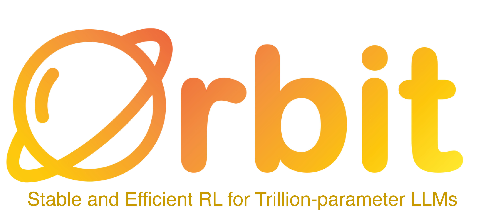

<div align="center">
  
</div>

<p align="center">
  A lightweight, ultra-scale RL post-training framework built around low-precision bases and BF16 adapters &mdash; so frontier-scale RL fits on a single node.
</p>

<p align="center">
  <a href="docs/index.html"></a>
  <a href="LICENSE"></a>
</p>

---

## Why Orbit

Today's leading LLMs cross the trillion-parameter mark, and the conventional RL post-training recipe demands high-precision, multi-node, full-parameter updates. Orbit takes a different route: hold the base at its **deployment precision** (INT4 / FP4 / FP8) and put gradients on a tiny **BF16 OFT or LoRA adapter**. The result &mdash; RL post-training of 1T-class models on a single 8&times;B200 node, with no precision gap between training and rollout.

We have used Orbit to run stable, end-to-end RL on **Kimi-K2.6 (~1T)**, **DeepSeek V4-Flash**, **DeepSeek V4-Pro (~1.6T)**, and the **Qwen3 MoE** family &mdash; all on a single-node setup.

## Highlights

|   | Capability | What it means |
|---|---|---|
| 🪶 | **Adapter-first RL** | BF16 OFT/LoRA adapters on a frozen low-precision base. Same kernels and quantization scheme at train and serve time. |
| 🛰️ | **Single-node trillion-scale** | 1T-class models fit on a single 8&times;B200 node. No cross-node orchestration, no precision drift. |
| ⚡ | **Low-precision native** | First-class support for INT4, NVFP4, FP8, and BF16, with parity preflight gates between Megatron and SGLang. |
| 🧩 | **PEFT-native** | LoRA and OFT adapters; PEFT KL launchers compute reference log-probs in-model (no separate reference workers), with async adapter double-buffering. |

## Installation

> **Supported runtime:** Python 3.12, CUDA 13.2, PyTorch 2.11. This is currently the only path the public launchers and helper scripts target.

Orbit expects sibling backend checkouts next to it:

```text
<workspace>/orbit
<workspace>/Megatron-Bridge
<workspace>/Megatron-Bridge/3rdparty/Megatron-LM
<workspace>/sglang
```

Keep these checkouts at the refs recorded in `pyproject.toml` under `tool.orbit.release.backend-pins`. `tool.uv.sources` currently points at local paths; when the backend repos are public, swap those entries for Git URLs at the same `rev` values.

### Set up the environment

1. **Install the CUDA/Torch layer.** Follow [CUDA-13-install.md](CUDA-13-install.md) end-to-end first.
2. **Sync Orbit and the backend sources:**

   ```bash
   cd orbit
   uv python pin 3.12
   uv venv
   source .venv/bin/activate
   uv sync --inexact
   ```

The manifest pins core CUDA/Torch packages so transitive dependencies can't silently swap in an untested build. `uv sync --inexact` preserves the CUDA/Torch packages installed by the CUDA guide.

> **Release maintainers:** verify a public clean-room install with `scripts/release/clean_room_gate.sh` after setting `PUBLIC_ORBIT_URL`. This gate targets the future public Git-ref release; it is not expected to pass against the interim local-path backend sources.

## Quickstart

Run any recipe under `examples/` &mdash; each launcher is an independent bash entrypoint with all hyperparameters inlined.

```bash
# A high-precision BF16 OFT run on Qwen3-4B
bash examples/high_precision/run-qwen3-4b-instruct-2507-bf16-math-oft.sh

# A low-precision FP8 OFT run on Qwen3-4B
bash examples/low_precision/run-qwen3-4b-fp8-math-oft.sh
```

Site-specific paths are passed in through environment variables. The most common ones:

| Variable | Required | Purpose |
|---|:---:|---|
| `ORBIT_VENV` | usually | Python environment with Orbit + backends. |
| `CUDA_HOME` | usually | CUDA 13.2 toolkit root. |
| `TRAIN_JSONL` | yes | Training prompt JSONL. |
| `HF_CKPT` | yes | HuggingFace checkpoint directory (quantized for low-precision recipes). |
| `MEGATRON_LOAD` | yes | Megatron distributed checkpoint root. |
| `TEST_JSONL` | if eval is on | Eval JSONL. Skip with `DISABLE_EVAL=1`. |
| `SAVE_DIR` | no | Output checkpoint directory. |
| `ENABLE_WANDB` | no | `auto` enables W&B if `$HOME/.wandb_key` exists; `0` disables. |

See [`examples/README.md`](examples/README.md) for the full environment knob reference and the async PEFT double-buffer notes.

### One-step smoke test

To exercise the command path without spending real cycles:

```bash
NUM_ROLLOUT=1 TOTAL_EPOCHS=1 TRAIN_ROWS=1 \
ROLLOUT_BATCH_SIZE=1 N_SAMPLES_PER_PROMPT=1 GLOBAL_BATCH_SIZE=1 \
DISABLE_EVAL=1 ENABLE_WANDB=0 \
bash examples/high_precision/run-qwen3-4b-instruct-2507-bf16-math-oft.sh
```

To inspect the final Python argv without starting Ray or loading the model, prepend `ORBIT_DRY_RUN_ARGV=1`.

## Roadmap

Orbit is under active development. On deck:

- [ ] **More launcher recipes** &mdash; broader model coverage (additional Qwen, Llama, GLM, and DeepSeek variants), more datasets, and more precision combinations.
- [ ] **Docker / containerized environments** &mdash; reproducible images and a documented env-setup path so getting a launcher running takes minutes, not a CUDA-13.2 module hunt.
- [ ] **On-policy distillation** &mdash; recipes and reference runs for `ADVANTAGE_ESTIMATOR=on_policy_distillation`, including teacher/student preflight.
- [ ] **Public Git-ref backends** &mdash; flip `tool.uv.sources` from local paths to public Git URLs for Megatron-Bridge, Megatron-LM, and SGLang once the upstream repos land.
- [ ] **Troubleshooting & ops docs** &mdash; common resolver, import, and launcher smoke failures, plus a multi-node story for sites that have capacity beyond a single 8&times;B200 box.

Have a request? Open an issue or PR.
## Citation

```bib
@article{spherelab2026orbit,
  author = {Qiu, Zeju and Chen, Le and Liu, Lixin and Xiao, Tim Z.
            and Feng, Yao and Huang, Yangyi and Liu, Zhen and Shi, Han
            and Wen, Yandong and Yu, Zhouliang and Sch{\"o}lkopf, Bernhard
            and Liu, Weiyang},
  title  = {Orbit: Stable and Efficient Reinforcement Learning for Trillion-Parameter LLMs},
  journal = {SphereLab Blog},
  year   = {2026},
  note   = {https://spherelab.ai/orbit}
}
```

## Acknowledgements

Orbit stands on the shoulders of these excellent projects:

- [MILES](https://github.com/radixark/miles)
- [verl](https://github.com/volcengine/verl)
- [slime](https://github.com/THUDM/slime)
- [SGLang](https://github.com/sgl-project/sglang)
- [Megatron-Bridge](https://github.com/NVIDIA/Megatron-Bridge)
- [Megatron-LM](https://github.com/NVIDIA/Megatron-LM)
- [DeepSeek-V4](https://huggingface.co/deepseek-ai/DeepSeek-V4-Pro/tree/main)
- [PyTorch](https://github.com/pytorch/pytorch)

## License

Orbit is released under the [Apache License 2.0](LICENSE).
