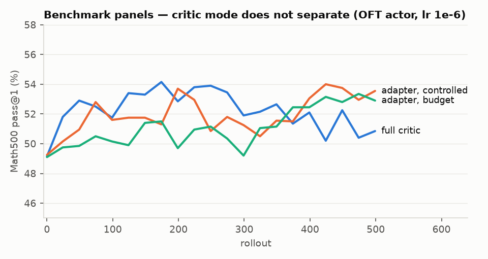
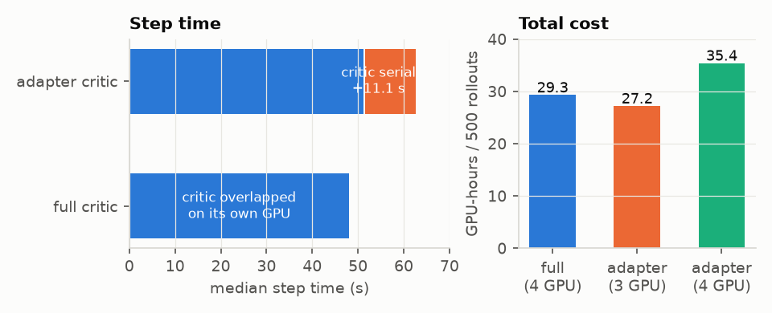
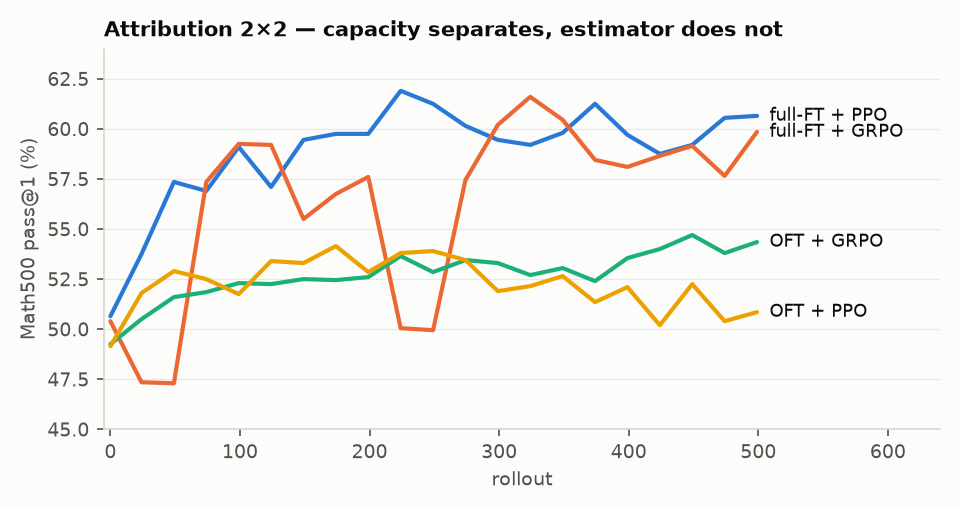
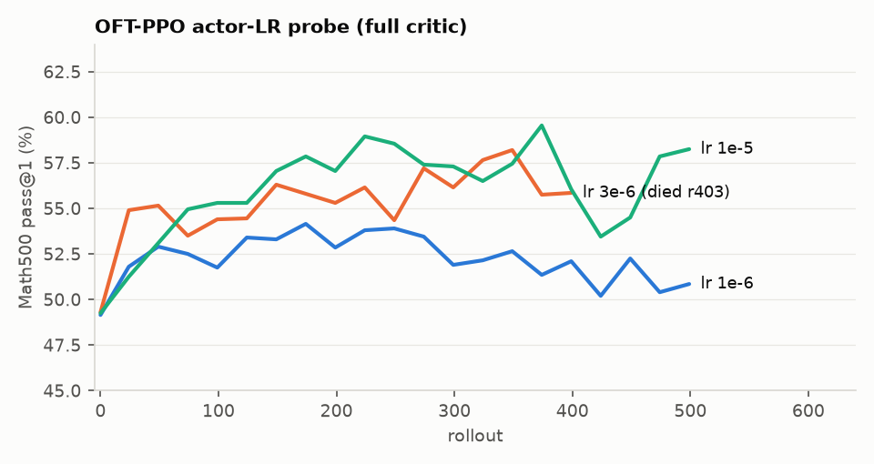
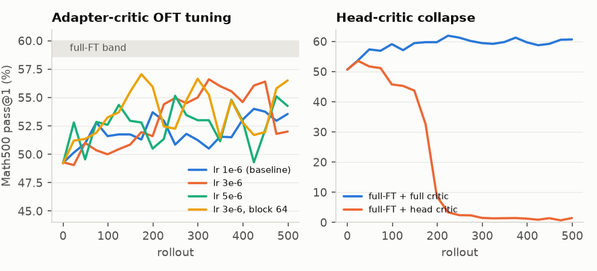

## Question

Orbit's PPO offers two critics: a **full critic** (a second 3B trunk + value head on its
own GPU) and an **adapter critic** (a value head + OFT adapter sharing the actor's frozen
trunk, one-trunk PPO). The [design doc](../plans/2026-08-06-ppo-critic-comparison-design.md)
asks two separately-reported questions: at *matched rollout capacity*, do they learn
equally well (controlled panel)? And at *matched hardware*, which is cheaper end-to-end
(fixed-budget panel)?

A follow-up question arose from the results: the initial numbers made PPO look worse than
GRPO, so a 2×2 attribution matrix ({OFT, full-FT} × {PPO, GRPO}) and an OFT actor-LR probe
were run to locate the real bottleneck.

## Setup

Qwen2.5-3B-Instruct BF16, TP=PP=1, actor trained as a **Canonical OFT adapter**
(block 32, eps 6e-5, `all-linear`, NCCL double-buffered weight sync) at lr 1e-6 constant;
critic lr 1e-5; PPO with GAE γ=λ=1, clip 0.2/0.28, value-clip 0.2, no KL, no entropy
bonus, advantages normalized, one critic-warmup rollout; strictly on-policy, one pass per
rollout. 64 prompts × 4 samples × 500 rollouts, temperature 1.0, 1024-token response cap,
deterministic math verifier (60 s verification timeout). Eval every 25 rollouts on
Math500/AIME24/AMC23 (math_alignment grading), 4 samples per prompt at temperature 1.0.
sglang v0.5.16 engines (1 GPU each, deterministic inference, triton attention, prefill
CUDA graph disabled). No periodic checkpoints (`SAVE_INTERVAL=100000`; end-save only, to
group storage) because the `zqiu` Lustre quota stalls multi-GB writes.

| Panel | Actor | Critic | Rollout | Total GPUs |
|:--|--:|--:|--:|--:|
| full critic (controlled = budget topology) | 1 | 1 | 2 | 4 |
| adapter critic, controlled | 1 | 0 | 2 | 3 (+1 idle) |
| adapter critic, budget | 1 | 0 | 3 | 4 |

Launched as parallel HTCondor jobs (4×B200 each):

```bash
cd /lustre/fast/fast/zqiu/clthegoat-orbit/uv_env_build
condor_submit_bid 100 bench_seed1234.sub          # 3 panels
condor_submit_bid 100 fullft_grpo.sub             # attribution + probes
condor_submit_bid 100 fullft_ppo.sub
condor_submit_bid 100 oft_grpo.sub
condor_submit_bid 100 oft_ppo_lr3e6.sub
condor_submit_bid 100 oft_ppo_lr1e5.sub
```

Inputs: HF model `/fast/groups/ei-slm/hf_models/Qwen2.5-3B-Instruct`; torch_dist
conversion via `tools/convert_hf_to_torch_dist.py` (5.8 GB, 16 shards, matches the
design-doc manifest); eval dir `/fast/groups/ei-slm/data/peft_arena_eval_math_alignment`.

## Results — controlled panel (learning)

**No detectable difference.** Math500 pass@1, mean ± sd over the last six eval gates
(rollouts 374–499); "final gate" shown to illustrate why single-gate reads mislead:

| Run | last-6-gate mean | final gate | base (gate 0) | train reward (last 100) |
|:--|--:|--:|--:|--:|
| full critic | **52.27 ± 1.00** | 50.85 | 49.15 | 0.317 |
| adapter critic, controlled | **52.33 ± 1.26** | 53.55 | 49.25 | 0.312 |
| adapter critic, budget | 51.61 ± 1.42 | 52.90 | 49.10 | 0.321 |

The final-gate spread (50.85 vs 53.55) is single-gate noise: per-gate sd is 1.0–1.4
points because eval samples 4 responses per prompt at temperature 1.0. Trajectories
differ in shape — full critic peaks earlier (54.1 at r174) and drifts back; the adapter
climbs later — but endpoints are equal within noise.



Secondary evals at the final gate (small sets, very gate-noisy): AIME24 pass@1
4.2/3.3/2.5, AMC23 35.6/31.3/31.3 (full / adapter-controlled / adapter-budget).

## Results — systems (time and memory)

**Time: the full critic is 23% faster per step, structurally.** Critic training costs
~11.1 s per rollout in either mode. The full critic overlaps it on its own GPU; the
adapter critic runs it *serially* on the actor's GPU (one GPU, one training pass at a
time — and it cannot fuse with the policy pass, since the critic drives the trunk through
its own adapter with its own optimizer). The arithmetic closes: 48.1 + 11.1 ≈ 62.3 s.

| | full critic | adapter (3 GPU) | adapter (4 GPU) |
|:--|--:|--:|--:|
| median step time | **48.1 s** | 62.3 s | 62.4 s |
| critic train (overlap / serial) | 11.1 s overlapped | 11.1 s serial | 11.1 s serial |
| wall clock, 500 rollouts | **440 min** | 543 min | 531 min |
| GPU-hours | 29.3 | **27.2** | 35.4 |



**The fixed-budget panel's premise failed**: re-investing the freed critic GPU into a
third rollout engine bought 2% (64.4 → 63.1 s/rollout) because training, not generation,
dominates the step (~23 s generate-wait vs ~31 s train). The freed GPU is better spent on
a different job.

**Memory: the adapter's structural win.** The full critic occupies an entire extra B200
with a second 3B trunk + fp32 master weights + Adam states (actor-scale: the actor
measured 48.8 GB peak-reserved at sync points; the critic full-finetunes the same
architecture). The adapter critic adds only a value head + OFT adapter on the shared
frozen trunk: actor-GPU footprint 44.6 GB, essentially unchanged. Caveat: these are
weight-sync-time snapshots (`log_device_memory_used` off; per-step peaks not
instrumented — listed as follow-up in the design doc). The ~45–50 GB + one-GPU
structural difference does not hinge on snapshot timing.

## Attribution — why PPO looked worse than GRPO

A full-FT GRPO companion run scored ~6 points higher than every OFT panel, initially
suggesting "PPO worse than GRPO." Completing the 2×2 shows the axis that matters:

| Math500 pass@1 (last-6-gate) | PPO (+full critic) | GRPO |
|:--|--:|--:|
| full finetuning | **60.02 ± 0.96** | 58.64 ± 0.78 |
| OFT adapter (lr 1e-6) | 52.27 ± 1.00 | 53.80 ± 0.80 |



**Capacity is worth ~6–8 points under either estimator; the estimator is worth ±1.5 and
flips sign.** Untuned PPO posts the best number of the whole study once given full
weights. The corroborating signature: OFT runs' pass@4 stays flat (~74) while full-FT
pass@4 rises — the adapter sharpens sampling toward known solutions; full FT finds new
ones. GRPO's remaining edge is cost: no critic at all → ~28 s/rollout, 17.8 GPU-h
(full-FT GRPO) vs ~36 s/rollout with the overlapped critic (full-FT PPO).

**OFT actor-LR probe** (full-critic PPO, all else fixed): lr 1e-5 recovers about 4 of the
~7 missing points at the cost of 2× gate volatility; 3e-6 sits between (partial — run died
at r403, see incidents).

| OFT-PPO actor LR | last-6-gate Math500 pass@1 |
|:--|--:|
| 1e-6 (benchmark) | 52.27 ± 1.00 |
| 3e-6 (through r399 only) | ≈ 56.5 ± 1.1 |
| 1e-5 | 56.61 ± 2.35 |



## Incidents (operational, all diagnosed)

- **Eval-scorer timeout trap**: the reward verifier defaults to a 10 s timeout; the
  benchmark recipe exports `ORBIT_PEFT_ARENA_REWARD_TIMEOUT_S=60`. A standalone launcher
  without it deflated Math500 by ~16 points on byte-identical generations (verification
  timeouts scored as wrong). One full-FT GRPO run was discarded and rerun for this.
- **Condor node-sharing port race**: two jobs packed on one 8-GPU node each get a private
  `/tmp`, blinding orbit's flock port coordination → sglang TCPStore `EADDRINUSE`.
  Mitigated with per-job `Machine !=` exclusions (an orbit-side fix would change the
  `git_commit` recorded in run manifests, breaking cross-run parity).
- **Silent engine death on i305** at rollout 412/500 (trainer saw only an HTTP
  disconnect; no engine-side error; memory/GPU steady). Cause unidentified; node
  excluded; run restarted from scratch (no checkpoints).
- **lr 3e-6 probe died at r403**: router HTTP failure on i301 mid-abort. Trajectory
  through r399 retained; not rerun.
- **Lustre user quota exhaustion** (24.3 TB / 20 TiB) stalls multi-GB checkpoint writes
  in D-state (`balance_dirty_pages`); the study therefore ran checkpoint-free with
  end-saves on group storage. A crash costs the whole run.

## Conclusions

1. **Critic choice does not affect learning quality** at this scale (one seed): 52.27 vs
   52.33, identical training rewards.
2. **Full critic buys latency with hardware**: −23% step time for +1 GPU (+~45–50 GB).
   **Adapter critic buys efficiency with latency**: fewest GPU-hours (27.2) and no second
   trunk — the property that matters where a second trunk is unaffordable (the Kimi-1T
   regime this feature exists for).
3. Do not spend the freed GPU on rollout at this scale.
4. **The estimator was never the bottleneck** — the OFT adapter at lr 1e-6 was. Raising
   adapter LR to 1e-5 closes over half the gap (with volatility); full FT closes it
   entirely and makes untuned PPO the best run of the study.

## Next steps

- Seeds 2–3 for the three benchmark panels (design-doc gate for learning claims).
- OFT LR middle ground: rerun 3e-6 to completion; consider 5e-6; consider a KL anchor
  for lr ≥ 1e-5 volatility.
- Peak-VRAM instrumentation (design-doc follow-up) for a precise memory table.

## Follow-up 1 — tuning the one-trunk adapter recipe (2026-08-11..15)

Goal: make the pure PEFT configuration (OFT actor + adapter critic, no full trunk
anywhere) approach full-FT's 58.6–60. Three benchmark-matched runs (seed 1234; two
earlier attempts were destroyed mid-run by the silent engine deaths — see incidents):

| Config | Math500 pass@1, last-6-gate | final gate | pass@4 (final) |
|:--|--:|--:|--:|
| lr 1e-6, block 32 (baseline) | 52.33 ± 1.26 | 53.6 | 75.4 |
| lr 3e-6, block 32 | **54.40 ± 2.03** | 52.0 | 71.2 |
| lr 5e-6, block 32 | 53.09 ± 2.17 | 54.2 | 75.0 |
| lr 3e-6, block 64 | 53.92 ± 2.05 | 56.5 | 74.2 |



**Verdict: LR buys ~+1.5–2 points and doubles gate volatility (sd 1.3 → ~2.1);
block-size capacity buys nothing; the ~5-point gap to full-FT is structural.**
5e-6 is already past the useful range. pass@4 stays at the base model's ~74 in
every cell — the adapter recipe still only sharpens sampling toward already-known
solutions, which is why no step-size/capacity knob closes the gap. (The earlier
full-critic LR probes read ~56.5 at partial horizon; with full 500-rollout
horizons and the adapter critic, the honest stable estimate is ~54.) Remaining
untried levers — a KL anchor to tame the volatility, larger adapter surface via
target modules — have diminishing prospects given the flat pass@4.

## Follow-up 2 — `--critic-mode head` (detached-trunk critic + full-FT actor): negative result

To combine full-FT capacity with the adapter critic's zero-memory profile, a new
`--critic-mode head` was implemented (branch `feat/detached-trunk-head-critic`,
TDD, 83 CPU tests + 0.5B GPU smoke): a value-head-only critic whose frozen
critic-side trunk view aliases the actor's storage — freeze applied inside the
model provider, before DDP wrap, so a value backward provably produces no trunk
gradients even while the actor full-finetunes the same bytes.

The mechanics work; **the algorithm does not**: at 3B benchmark settings the run
peaked at 53.5 (r24), decayed from ~r100, and collapsed to ~1.4 by r250
(fig. above, right). Critic value loss never converged — stuck at 2–4 versus the
full critic's 0.13–0.18, a ~20× gap — so advantages were noise, and with no KL
anchor the policy walked into degenerate max-length outputs (reward → 0,
response length → the 1024 cap). Conclusion: **a single linear head on detached,
drifting features cannot supply usable values at this scale**; the full critic's
dedicated (or the adapter critic's frozen-trunk) representation is load-bearing.
Untried variants: deeper MLP head, higher critic LR / longer critic-only warmup,
KL anchor. For full-FT actors, GRPO (no critic, 58.64, cheapest) remains the
recommended default.

## Incidents, continued

- **Silent engine deaths became the dominant operational cost**: 6 incidents
  across 6 distinct machines (i305, i301, i403, i303, i401, +1), all the same
  signature — sglang engine stops responding mid-generation, zero engine-side
  trace, condor reports normal termination — destroying entire runs under the
  no-checkpoint policy (two full sweep attempts lost). Cause still unidentified.
  Mitigation queued for any further long runs: adapter-run sidecar checkpoints
  are only ~370 MB, so `SAVE_INTERVAL=100` on group storage plus resume plumbing
  makes runs death-tolerant at negligible cost.
